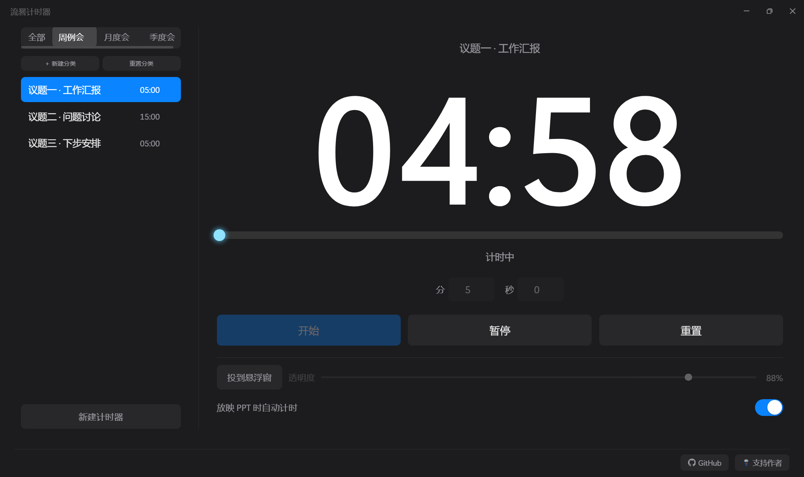

# 流晷计时器

会议场景专用桌面计时器。**免安装单文件**，双击即用；倒计时可一键投成全屏大字，也能缩成小挂件浮在 PPT 上——放映 PPT/WPS 时还会自动弹出并开始计时。

## 功能

- **全屏投屏计时**：点一下 □ 就铺满整屏，数字随屏幕比例放大（1080p 下约 290px），会议室最后一排也看得清
- **桌面悬浮窗**：200px 真透明小挂件，永远置顶（压得住 PPT 放映），可拖到任意位置并记住位置，透明度 20%~100% 可调
- **PPT / WPS 放映自动计时**：进入全屏放映约 1 秒内自动弹出悬浮窗并开始倒数，退出放映自动暂停并保留剩余时间。支持 Microsoft PowerPoint 与 WPS 演示，无需插件、纯只读检测
- **多屏优化**：接投影仪/副屏放映时，悬浮窗自动落在你面前的演讲者屏上，不会跑到投影画面里
- **多计时器 + 分类**：常用时长存成预设，按分类分组管理；分类可**新建、删除、一键重置**
- **渐变流光进度条**：剩余过半、剩 20% 时分段变色预警，到点数字变红闪烁（不发声，不打断会议）
- **Windows 风格窗口控制**：右上角 ─ □ ✕，关闭悬停变红，双击顶栏也能放大/还原
- **零打扰**：不联网、不弹广告、不驻留后台、不写注册表

| 主界面 | 悬浮窗 |
|---|---|
|  |  |

## 下载

到 [Releases](../../releases/latest) 下载 `liugui-timer-vX.Y.Z-portable.exe`，双击即可运行，**无需安装**。

> GitHub 在国内下载可能较慢，若打不开可多试几次，或使用加速镜像。

- 系统要求：Windows 10 / 11，64 位
- 单文件约 100 MB（内置运行环境，因此体积偏大，换来的好处是**不需要另外装任何东西**）
- 数据保存在 `%APPDATA%\流晷计时器\`，删掉该文件夹即可完全卸载
- 完整性校验：每个 Release 说明里附有 exe 的 SHA256 值

## 完全免费

本软件**完全免费**：全部功能、无时间限制、无广告、不上传任何数据。

它解决的场景很简单：周例会每个议题限时发言、月度季度汇报控时——把时长设好，放一边，剩下的交给它提醒。

## 赞赏

如果流晷计时器让你的会议顺畅了一点，欢迎请作者喝杯咖啡，也是继续做下去的动力：

> 赞赏完全自愿，功能不设任何差别——不用赞赏也一样是完整版。

## 常见问题

**Q：需要安装吗？会被杀毒软件报毒吗？**
免安装，双击运行。因为没买代码签名证书，个别杀毒软件可能对未签名程序提示"未知发布者"，选择"仍要运行"即可；也可以用 Release 页面的 SHA256 值校验文件完整性。

**Q：PPT 自动计时支持哪些软件？**
Microsoft PowerPoint（Office 2016 及以上 / 365）和 WPS 演示。原理是检测系统里的放映窗口（只读，不注入、不修改 PPT 文件），在界面里用开关控制，不需要时关掉即可。

**Q：倒计时结束有声音吗？**
没有。会议室里突然响铃反而尴尬，所以只做视觉提示（数字变红闪烁 + 进度条预警色）。

**Q：换电脑了，我的预设会丢吗？**
预设和分类保存在本机 `%APPDATA%\流晷计时器\`，拷 exe 到新电脑后需要重新设置（数据跟电脑走）。数据随 exe 一起带走的"便携模式"在计划中。

**Q：会上网吗？**
不会。软件不发起任何网络请求，倒计时、预设、悬浮窗位置全部存在本地。

## 更新日志

见 [CHANGELOG.md](CHANGELOG.md)。
